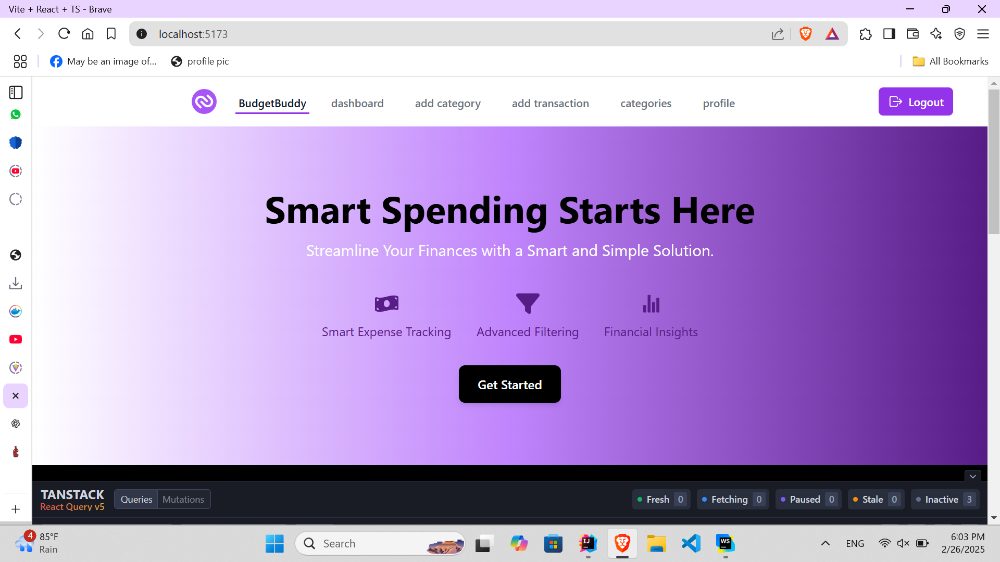
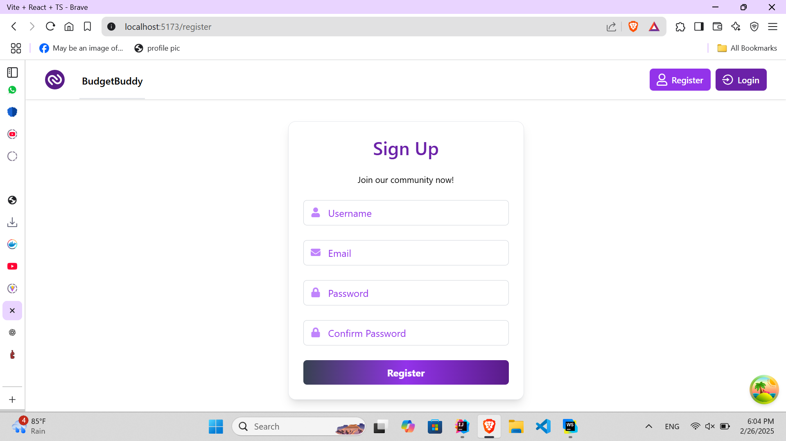
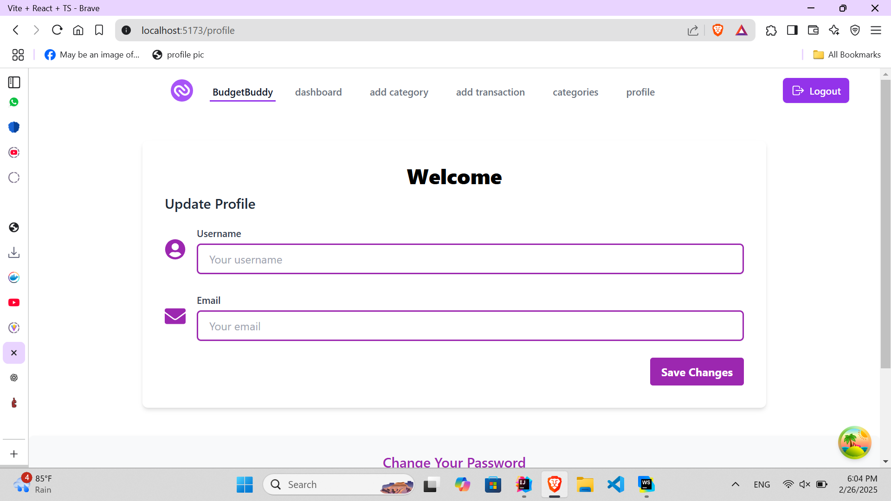
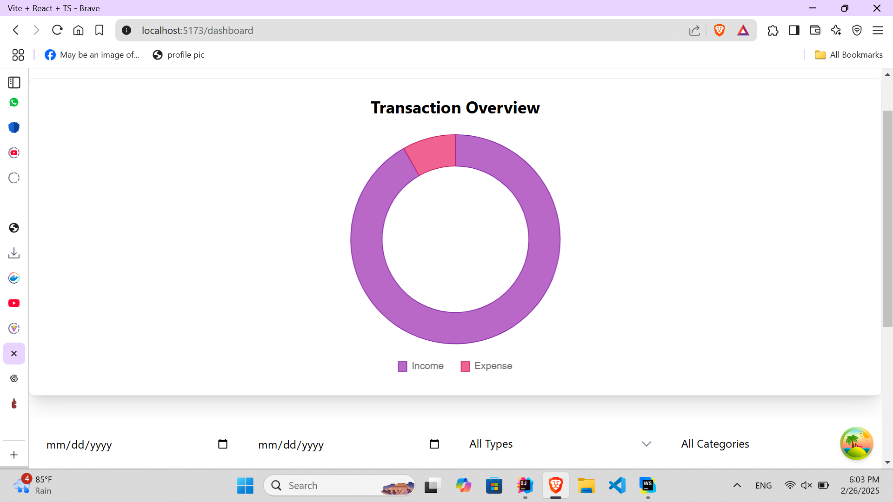
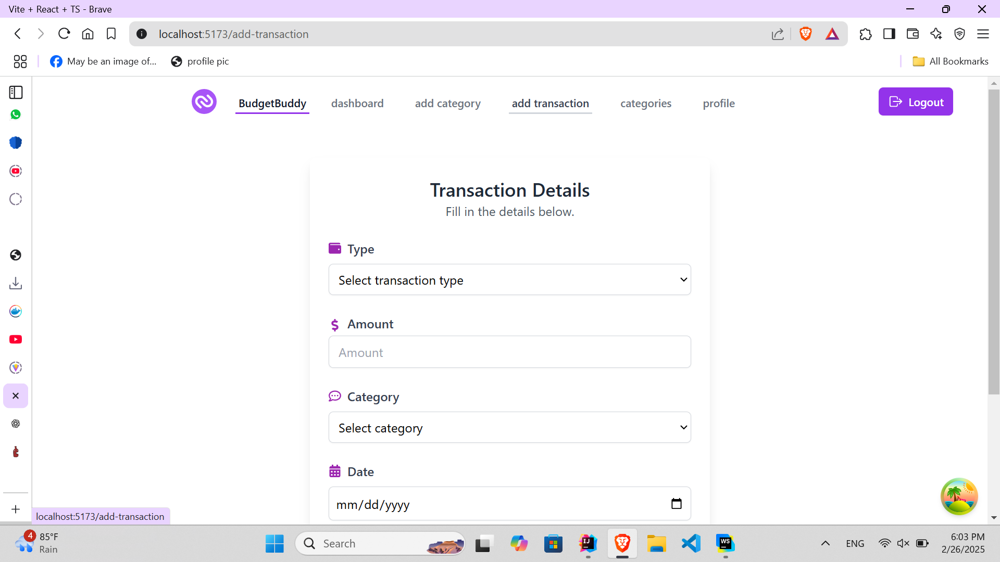

<a href="https://git.io/typing-svg">     
  
</a>

## 🌍 About the Project

**BudgetBuddyr** is a personal expense tracker application built using the MERN stack (MySQL with Prisma, Express, React, Node.js). This project allows users to track their expenses efficiently and analyze their spending patterns.

## 💻 Frontend Technologies Used

- **React**: JavaScript library for building user interfaces.
- **TypeScript**: A superset of JavaScript for type safety.
- **Tailwind CSS**: A utility-first CSS framework for rapidly building custom designs.
- **Vite**: A fast build tool and development server.
- **Redux**: State management tool for React applications.
- **Formik & Yup**: Libraries for handling forms and form validation.
- **Chart.js**: Library for creating interactive charts to visualize expense data.
- **React Router**: Routing library for single-page applications.
- **Axios**: Promise-based HTTP client for making requests to the backend.

## ⚙️ Project Setup

### Requirements

- Node.js (>=16.x)
- npm (>=8.x)
- MySQL database

### Installation

1. Clone the repository:

   ```bash
   git clone https://github.com/sachiniwathudura/BudgetBuddy-frontend.git

   ```
2. Install dependencies:
 ```bash
    npm install
```
3.To run the development server:
```bash
   npm run dev
```

## 🚀 Features
- Add, edit, and delete expense records.
- View a summary of expenses in various categories.
- Interactive charts to visualize spending trends.
- Responsive design using Tailwind CSS.
- Form validation with Formik and Yup.
- State management using Redux.

## 📦 Dependencies
- @headlessui/react: UI components for building modern interfaces.
- @heroicons/react: High-quality icons for your UI.
-  @reduxjs/toolkit: Efficient and flexible state management with Redux.
-  axios: HTTP client for making API requests.
-  chart.js: JavaScript library for creating charts.
- formik: Library for building forms in React.
- react-router-dom: Declarative routing for React apps.
- yup: Schema validation library for JavaScript.

## 🛠️ Development Tools
- Vite: A build tool that focuses on speed and performance.
- tailwindcss: Utility-first CSS framework for styling the application.
-  eslint: Linter for ensuring code quality.
- typescript: TypeScript language for type safety.

## 📸 Screenshots
 <div style="display: flex; flex-wrap: wrap; justify-content: center; gap: 16px; text-align: center;">
  <div style="flex: 1 1 calc(40% - 16px); max-width: calc(40% - 16px);">
    <h3>Home Page</h3>
    
  </div>
  <div style="flex: 1 1 calc(40% - 16px); max-width: calc(40% - 16px);">
    <h3>Register Page</h3>
    
  </div>
<div style="flex: 1 1 calc(40% - 16px); max-width: calc(40% - 16px);">
    <h3>Update Profile Page</h3>
    
  </div>
<div style="flex: 1 1 calc(40% - 16px); max-width: calc(40% - 16px);">
    <h3>Dashboard</h3>
    
  </div>
<div style="flex: 1 1 calc(40% - 16px); max-width: calc(40% - 16px);">
    <h3>Add Transaction page</h3>
    
  </div>
</div>


### Backend

The backend for this application is built using the MERN stack (MySQL with Prisma, Express, Node.js), and you can find the backend repository here:

[Backend Repository Link](https://github.com/sachiniwathudura/BudgetBuddy-backend.git)

## 📝 License
This project is licensed under the MIT License - see the LICENSE file for details.


## 📧 Contact

For inquiries or collaboration:
- **Author:** [Sachini Madubhashini](https://github.com/sachiniwathudura)

<div align="center">
    © 2025 All Rights Reserved, Designed By Sachini Madubhashini
</div>


⭐ **Feel free to contribute, star the repo, and explore more!**